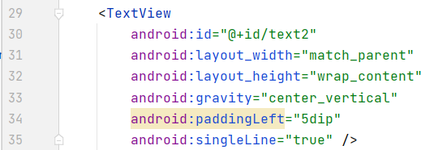

# NotePad
基于原有的代码进行功能扩展  
原文代码看这里: [notepad-master](https://github.com/llfjfz/NotePad)  
我的项目地址：[notepad](https://github.com/linbxAndrew/notepad)
除了基本的时间戳、搜索功能扩展，我还实现了背景美化、背景切换


## 1. 原始的项目结构和功能
- 主要的类:  
NotesList类 应用程序的入口，笔记本的首页面会显示笔记的列表  
NoteEditor类 编辑笔记内容的Activity  
TitleEditor类 编辑笔记标题的Activity  
NotePadProvider 这是笔记本应用的ContentProvider，也是整个应用的关键所在  
后面我们会添加NoteSearch类，作为查询笔记内容的Activity  
  

- 主要的布局文件：  
note_editor.xml 笔记主页面布局  
notelist_item.xml 笔记主页面每个列表项布局  
title_editor.xml 修改笔记主题布局  
同样，后面后添加note_search.xml 笔记内容查询布局  
  

- 主要的菜单文件：  
editor_options_menu.xml 编辑笔记内容的菜单布局  
list_context_menu.xml 笔记内容编辑上下文菜单布局  
list_options_menu.xml 笔记主页面可选菜单布局  
  
- 数据装配：
NoteList使用SimpleCursorAdapter来装配数据，首先查询数据库的内容
```java
Cursor cursor = managedQuery(
     getIntent().getData(),           
     PROJECTION,                      
     null,                             
     null,                             
     NotePad.Notes.DEFAULT_SORT_ORDER);
```
然后通过SimpleCursorAdapter来进行装配
```java
SimpleCursorAdapter adapter
     = new SimpleCursorAdapter(
               this,                             
               R.layout.noteslist_item,          
               cursor,                           
               dataColumns,
               viewIDs);
```
- 页面跳转：
不管是可选菜单、上下文菜单中的操作，还是单击列表中的笔记条目，其相应的页面跳转都是通过Intent的Action+URI进行的
## 2. 基本功能扩展
### 2.1 时间戳
在 `noteslist_item.xml`中, 添加一个TextView作为时间戳的显示  
  
在 `NotePadProvider.java`, 添加显示时间的字段。你可以看到它已经在内部类`static class DatabaseHelper`存在了，所以我们不需要修改  


在`NoteList.java`中的**PROJECT**中定义显示的时间，在**dataColumns**，**viewIDs**中补充时间部分：  
  
  


把时间戳改为以时间格式存入。  
改动地方分别为`NotePadProvider.java`中的**insert**方法和`NoteEditor.java `中的**updatenote**方法: 用SimpleDateFormat工具类格式化时间   
NotePadProvider.java: insert  
  
NoteEditor.java: updatenote  


效果：

### 2.2 搜索功能
修改 `list_options_menu.xml`, 添加一个搜索的菜单项。  


在布局文件, 新建 `note_search.xml` 来显示搜索界面。  
  


新建 `NoteSearch.java`, 继承listActivity, 实现 SearchView.OnQueryTextListener.  
  
  

在 `NoteList.java`，找到onOptionsItemSelected, 在switch语句中, 为搜索菜单项添加case。  
当选中搜索菜单项后，触发此case中方法，转到NoteSearch.java中。  


在`AndroidManifest.xml`, 注册NoteSearch(提示已注册，无需再注册).  


效果：

## 3. 格外功能
### 3.1 UI美化
在NotePad的内部类Notes中，添加？？？？？？？？
```java
        public static final String COLUMN_NAME_BACK_COLOR = "color";
        public static final int DEFAULT_COLOR = 0; //白
        public static final int YELLOW_COLOR = 1; //黄
        public static final int BLUE_COLOR = 2; //蓝
        public static final int GREEN_COLOR = 3; //绿
        public static final int RED_COLOR = 4; //红
```
在NotPadProvider.java中，修改onCreate
```java
       public void onCreate(SQLiteDatabase db) {
           db.execSQL("CREATE TABLE " + NotePad.Notes.TABLE_NAME + " ("
                   + NotePad.Notes._ID + " INTEGER PRIMARY KEY,"
                   + NotePad.Notes.COLUMN_NAME_TITLE + " TEXT,"
                   + NotePad.Notes.COLUMN_NAME_NOTE + " TEXT,"
                   + NotePad.Notes.COLUMN_NAME_CREATE_DATE + " INTEGER,"
                   + NotePad.Notes.COLUMN_NAME_MODIFICATION_DATE + " INTEGER,"
                   + NotePad.Notes.COLUMN_NAME_BACK_COLOR + " INTEGER"
                   + ");");
       }
```
在NotePadProvider的insert中添加
```java
        // 新建笔记，背景默认为白色
        if (values.containsKey(NotePad.Notes.COLUMN_NAME_BACK_COLOR) == false) {
            values.put(NotePad.Notes.COLUMN_NAME_BACK_COLOR, NotePad.Notes.DEFAULT_COLOR);
        }
```
在NotePadProvider的static中，添加
```java
        sNotesProjectionMap.put(
                NotePad.Notes.COLUMN_NAME_BACK_COLOR,
                NotePad.Notes.COLUMN_NAME_BACK_COLOR);
```
自定义一个CursorAdapter继承SimpleCursorAdapter，既能完成cursor读取的数据库内容填充到item，又能将颜色填充，  
并将NoteList中用的SimpleCursorAdapter改使用MyCursorAdapter：  
- 首先新建MyCursorAdapter.java，代码：  
```java
public class MyCursorAdapter extends SimpleCursorAdapter {
    public MyCursorAdapter(Context context, int layout, Cursor c,
                           String[] from, int[] to) {
        super(context, layout, c, from, to);
    }
    @Override
    public void bindView(View view, Context context, Cursor cursor){
        super.bindView(view, context, cursor);
        //从数据库中读取的cursor中获取笔记列表对应的颜色数据，并设置笔记颜色
        int x = cursor.getInt(cursor.getColumnIndex(NotePad.Notes.COLUMN_NAME_BACK_COLOR));
        switch (x){
            case NotePad.Notes.DEFAULT_COLOR:
                view.setBackgroundColor(Color.rgb(255, 255, 255));
                break;
            case NotePad.Notes.YELLOW_COLOR:
                view.setBackgroundColor(Color.rgb(247, 216, 133));
                break;
            case NotePad.Notes.BLUE_COLOR:
                view.setBackgroundColor(Color.rgb(165, 202, 237));
                break;
            case NotePad.Notes.GREEN_COLOR:
                view.setBackgroundColor(Color.rgb(161, 214, 174));
                break;
            case NotePad.Notes.RED_COLOR:
                view.setBackgroundColor(Color.rgb(244, 149, 133));
                break;
            default:
                view.setBackgroundColor(Color.rgb(255, 255, 255));
                break;
        }
    }
}
```
NoteList中的PROJECTION添加颜色项：
```java
private static final String[] PROJECTION = new String[] {
        NotePad.Notes._ID, // 0
        NotePad.Notes.COLUMN_NAME_TITLE, // 1
        //扩展 显示时间 颜色
        NotePad.Notes.COLUMN_NAME_MODIFICATION_DATE, // 2
        NotePad.Notes.COLUMN_NAME_BACK_COLOR,
        };
```
- 然后修改NotesList.java：
将
```java
        SimpleCursorAdapter adapter
                = new SimpleCursorAdapter(
                this,                             // The Context for the ListView
                R.layout.noteslist_item,          // Points to the XML for a list item
                cursor,                           // The cursor to get items from
                dataColumns,
                viewIDs
        );
```
改成
```java
        MyCursorAdapter adapter
                = new MyCursorAdapter(
                this,                             // The Context for the ListView
                R.layout.noteslist_item,          // Points to the XML for a list item
                cursor,                           // The cursor to get items from
                dataColumns,
                viewIDs
        );
```


效果：


### 3.2 背景更换
在editor_options_menu.xml中添加修改背景颜色选项
```xml
    <item android:id="@+id/menu_color"
        android:icon="@drawable/ic_menu_color"
        android:title="@string/menu_delete"
        android:showAsAction="ifRoom|withText" />
```
layout文件夹下创建note_color.xml。在此之前添加color.xml:
color.xml:
```xml
<?xml version="1.0" encoding="utf-8"?>
<resources>
    <color name="color_white">#FFFFFF</color>
    <color name="color_yellow">#F7D885</color>
    <color name="color_blue">#A5CAED</color>
    <color name="color_green">#A1D6AE</color>
    <color name="color_red">#F49585</color>
</resources>
```
note_color.xml:
```xml
<?xml version="1.0" encoding="utf-8"?>
<LinearLayout xmlns:android="http://schemas.android.com/apk/res/android"
    android:orientation="horizontal" android:layout_width="match_parent"
    android:layout_height="match_parent">
    <ImageButton
        android:id="@+id/color_white"
        android:layout_width="0dp"
        android:layout_height="50dp"
        android:layout_weight="1"
        android:background="@color/colorWhite"
        android:onClick="white"/>
    <ImageButton
        android:id="@+id/color_yellow"
        android:layout_width="0dp"
        android:layout_height="50dp"
        android:layout_weight="1"
        android:background="@color/colorYellow"
        android:onClick="yellow"/>
    <ImageButton
        android:id="@+id/color_blue"
        android:layout_width="0dp"
        android:layout_height="50dp"
        android:layout_weight="1"
        android:background="@color/colorBlue"
        android:onClick="blue"/>
    <ImageButton
        android:id="@+id/color_green"
        android:layout_width="0dp"
        android:layout_height="50dp"
        android:layout_weight="1"
        android:background="@color/colorGreen"
        android:onClick="green"/>
    <ImageButton
        android:id="@+id/color_red"
        android:layout_width="0dp"
        android:layout_height="50dp"
        android:layout_weight="1"
        android:background="@color/colorRed"
        android:onClick="red"/>
</LinearLayout>
```
新建NoteColor.java：
```java

```
在AndroidManifest.xml中将这个Acitvity主题定义为对话框样式：
```xml
<activity android:name="NoteColor"
    android:theme="@android:style/Theme.Holo.Light.Dialog"
    android:label="ChangeColor"
    android:windowSoftInputMode="stateVisible"/>
```
在NoteEditor中添加方法changeColor：
```java
    //跳转改变颜色的activity，将uri信息传到新的activity
    private final void changeColor() {
        Intent intent = new Intent(null,mUri);
        intent.setClass(NoteEditor.this,NoteColor.class);
        NoteEditor.this.startActivity(intent);
    }
```
在NoteEditor中的onOptionsItemSelected()方法的switch中添加选项:
```java
    case R.id.menu_color:
        changeColor();
        break;
```
在NoteEditor中添加方法changeColor
```java
    //跳转改变颜色的activity，将uri信息传到新的activity
    private final void changeColor() {
        Intent intent = new Intent(null,mUri);
        intent.setClass(NoteEditor.this,NoteColor.class);
        NoteEditor.this.startActivity(intent);
    }
```


